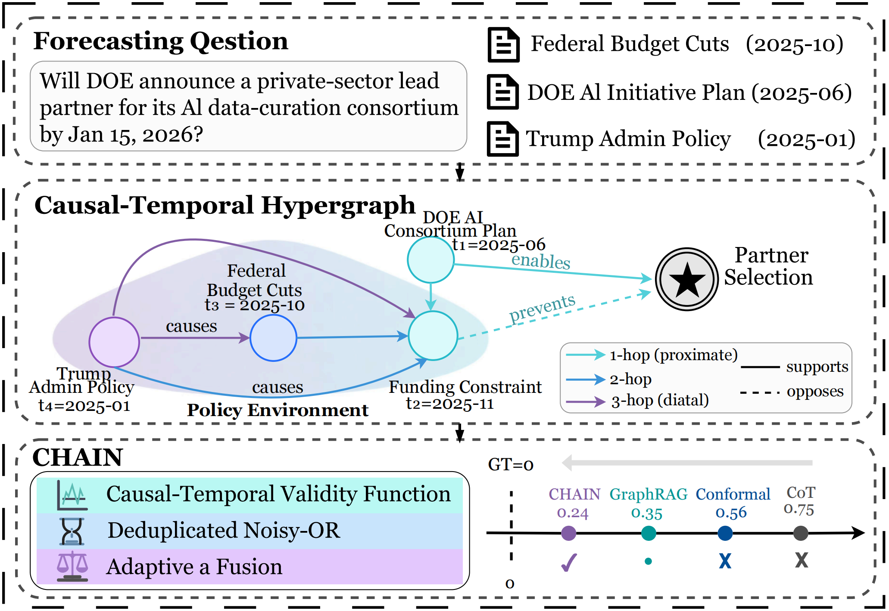
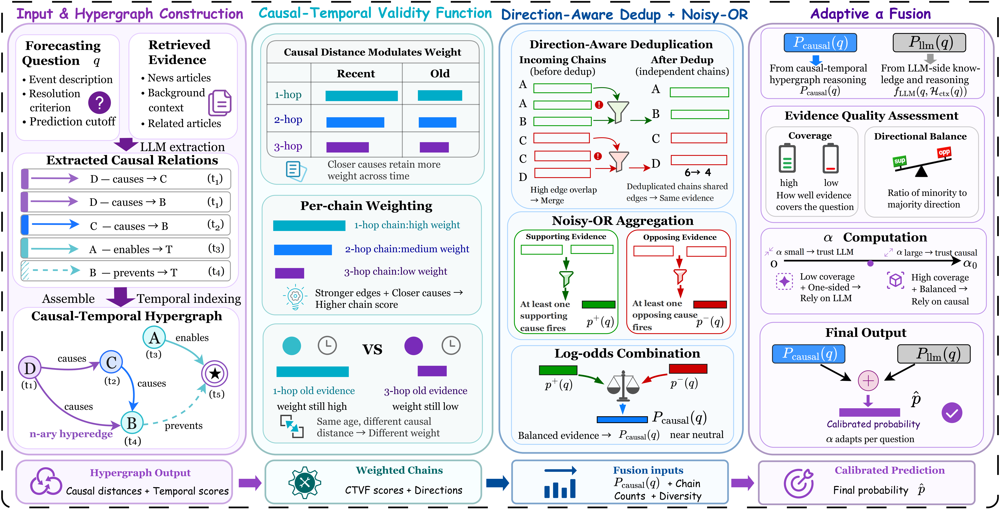
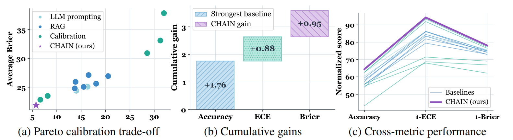

# CHAIN: Calibrated LLM Forecasting via Causal-Temporal Hypergraph Inference

<div align="center">

[](https://arxiv.org/abs/2609.36689)
[](https://qwenqking.github.io/Chain-Homepage/)
### **CHAIN: Calibrated LLM Forecasting via Causal-Temporal Hypergraph Inference**

[📄 Paper](https://arxiv.org/abs/2609.36689) | [🌐 Homepage](https://qwenqking.github.io/Chain-Homepage/) | [💬 Contact](mailto:wenjinliu23@outlook.com)
</div>

---

## Overview

<div align="center">
  
</div>

**CHAIN** addresses a critical challenge in probabilistic large language model (LLM) forecasting: model probability outputs can exhibit systematic **calibration bias** that varies across domains and question types, undermining the reliability of probabilistic forecasts for decision-making under uncertainty.

Existing calibration approaches typically correct probability outputs only **after prediction is complete**, without explicitly modeling the structural sources of bias within the forecasting process itself.

To address this limitation, **CHAIN** formulates probabilistic forecasting over a **causal-temporal hypergraph** and decomposes the prediction process into three stages:

1. **Evidence Weighting**
2. **Evidence Aggregation**
3. **Source Fusion**

CHAIN introduces stage-specific mechanisms to mitigate calibration bias at each stage, enabling structurally calibrated and more reliable probabilistic forecasting.

<div align="center">
  
</div>

### Causal-Temporal Validity Function

The **Causal-Temporal Validity Function (CTVF)** assigns validity-aware weights to evidence by jointly considering its **temporal recency** and **causal topological proximity** to the forecasting target.

Instead of applying the same temporal decay to all retrieved evidence, CHAIN modulates temporal attenuation according to causal distance, allowing causally proximal evidence to retain greater influence while suppressing distant or weakly relevant evidence.

CTVF further incorporates recurrence and semantic salience to construct chain-level confidence scores over the causal-temporal hypergraph.

### Direction-Aware Noisy-OR

Retrieved causal evidence may contain multiple highly overlapping paths that refer to the same underlying information. Treating these paths as independent evidence can systematically inflate forecasting confidence.

CHAIN therefore performs **direction-aware deduplication**, separating supporting and opposing causal chains and removing highly overlapping paths within each polarity.

The remaining approximately independent causal chains are aggregated using **polarity-wise Noisy-OR**, followed by a neutral-anchored log-odds combination to produce a causal probability estimate.

### Causal-Coverage-Balanced Adaptive Fusion

The reliability of structured causal evidence varies across forecasting questions.

CHAIN therefore computes a question-specific causal coverage score based on:

- the number of retained approximately independent causal chains,
- their average confidence,
- evidence reliability, and
- directional balance between supporting and opposing evidence.

This coverage score determines an **adaptive fusion weight** that dynamically combines the causal probability estimate with the probability produced by the LLM.

When causal evidence is abundant, reliable, and directionally balanced, CHAIN assigns greater weight to the causal estimate. When evidence is sparse, weak, or strongly one-sided, the framework relies more heavily on the LLM-side estimate.

---

## Experimental Setup

We evaluate **CHAIN** on **eight public event-forecasting datasets**, covering both in-distribution and held-out-source out-of-distribution settings.

### Datasets

**In-distribution datasets:**

- **AI-Futures**
- **Metaculus**
- **Polymarket**
- **Future-as-Label**

**Out-of-distribution datasets:**

- **Clinical Trial Outcomes (CTO)**
- **FOReCAst**
- **Golf-Forecasting**
- **KalshiBench**

### LLM Backbones

CHAIN is evaluated with three LLM backbones:

- **GPT-4o-mini**
- **Gemini-2.0-Flash**
- **DeepSeek-V3**

The causal-temporal hypergraph is constructed using **GPT-4o-mini** as the causal-relation extractor, while **text-embedding-3-small** is used as the shared encoder.

### Baselines

We compare CHAIN with 13 baselines spanning direct forecasting, chain-of-thought prompting, retrieval-augmented generation, and post-hoc probability calibration:

- LLM Direct
- LLM CoT
- AutoCast
- NaiveRAG
- GraphRAG
- LightRAG
- HippoRAG
- HyperGraphRAG
- Temperature Scaling
- Platt Scaling
- Isotonic Regression
- Histogram Binning
- Conformal Adjustment

### Evaluation Metrics

We evaluate probabilistic forecasting performance using seven metrics:

- **Expected Calibration Error (ECE) ↓**
- **Adaptive Calibration Error (ACE) ↓**
- **Maximum Calibration Error (MCE) ↓**
- **Reliability (Rel) ↓**
- **Negative Log-Likelihood (NLL) ↓**
- **Brier Score ↓**
- **Accuracy (Acc) ↑**

---

## Experimental Results

### Main Results

Across the four in-distribution forecasting datasets and all three evaluated LLM backbones, **CHAIN achieves lower ECE and Brier scores while maintaining or improving forecasting accuracy compared with the evaluated baselines**.

The results indicate that introducing additional retrieved evidence alone is not sufficient to guarantee calibrated probability estimates. CHAIN instead improves forecasting by explicitly addressing calibration bias within the prediction process through causal-temporal evidence weighting, aggregation, and adaptive source fusion.

### Out-of-Distribution Generalization

<div align="center">
  
</div>

The figure above illustrates the calibration and predictive performance of **CHAIN with DeepSeek-V3** on four held-out-source OOD forecasting datasets.

CHAIN maintains lower calibration error under distribution shift while preserving or improving prediction accuracy, indicating that the calibration gains are not limited to the in-distribution forecasting benchmarks.

Results with GPT-4o-mini and Gemini-2.0-Flash are also reported in the paper, with complete DeepSeek-V3 OOD results provided in the appendix.

---

## Ablation Study

The ablation study evaluates the contribution of the three major components of CHAIN:

- **w/o CTVF**
- **w/o Noisy-OR**
- **w/o Adaptive α**
- **CHAIN (Full)**

Removing either CTVF or Direction-Aware Noisy-OR consistently increases calibration error, showing the importance of causal-temporal evidence weighting and redundancy-aware evidence aggregation.

Replacing question-specific adaptive fusion with a fixed fusion weight also degrades calibration performance, supporting the use of evidence-dependent source weighting.

---

## Structural Calibration vs. Post-Hoc Calibration

CHAIN performs calibration **within the forecasting process**, rather than applying only an output-level correction after prediction.

The paper compares CHAIN with multiple post-hoc calibration methods, including:

- Temperature Scaling
- Platt Scaling
- Isotonic Regression
- Histogram Binning
- Conformal Adjustment

Additional experiments further compare CHAIN with modern post-hoc calibration methods under a leakage-safe fitting protocol, including Beta Calibration, Venn-Abers, and Binary Dirichlet Calibration.

Across the evaluated settings, CHAIN achieves improved calibration and predictive performance by explicitly modeling the structural sources of uncertainty in evidence weighting, evidence aggregation, and source fusion.

---

## Adaptive Fusion

CHAIN uses a question-specific adaptive fusion weight instead of a globally fixed coefficient.

The fusion weight is determined from the quality and coverage of the available causal evidence. Experiments comparing adaptive fusion with fixed fusion weights show that adaptive weighting achieves lower macro-average ECE and Brier scores across the evaluated forecasting datasets.

---

## Robustness and Sensitivity Analysis

The paper provides additional analyses of several factors affecting CHAIN, including:

- maximum causal search depth,
- retained-chain budget,
- outgoing-edge fan-out,
- chain-score pruning threshold,
- causal-distance sensitivity,
- deduplication threshold,
- hypergraph scale,
- alternative hypergraph extractors, and
- the number of LLM forecasting calls.

CHAIN is also evaluated using **GPT-4.1-nano** as an alternative hypergraph extractor. The results show that the framework retains its calibration and predictive advantages under different extraction models, while the default GPT-4o-mini extractor provides the strongest overall performance among the evaluated extractor settings.

---

## Implementation Details

The experiments reported in the paper use the following common setup:

- **Hypergraph extractor:** GPT-4o-mini
- **Shared encoder:** text-embedding-3-small
- **Embedding dimension:** 1536
- **Inference temperature:** 0.3
- **Maximum generation length:** 8192 tokens
- **Chunk size:** 512 tokens
- **Chunk overlap:** 64 tokens
- **RAG top-k:** 10
- **Similarity metric:** cosine similarity

The default CHAIN-specific hyperparameters reported in the paper include:

| Parameter | Description | Default |
|---|---|---:|
| `d_max` | Reachability / search depth cap | 4 |
| `θ` | Jaccard threshold for same-polarity deduplication | 0.5 |
| `η` | Recurrence saturation temperature | 5.0 |
| `M_r(e)` | Default similarity when unavailable | 0.5 |
| `v_fb` | Missing-time CTVF fallback | 0.25 |
| `k_sat` | Reliability saturation anchor | 10 |
| `β_0` | Directional-balance floor | 0.3 |
| `Z` | Causal-coverage normalization constant | 5.0 |
| `α_b` | Adaptive-fusion mapping scale | 0.5 |
| `α_0` | Fusion upper bound | 0.6 |
| `Ω_0` | Coverage activation threshold | 0.3 |
| `ζ` | Sigmoid sharpness | 3.0 |

The reported comparison results are averaged over **three independent runs** using matched decoding settings, evaluation sets, corpus boundaries, and backbone LLMs across methods.

---

## BibTeX

If you find this work helpful for your research, please cite:

```bibtex
@misc{liu2026chain,
      title={CHAIN: Calibrated LLM Forecasting via Causal-Temporal Hypergraph Inference},
      author={Wenjin Liu and Chenxi Wang and Yue Lu and Zhe Cui and Haoran Luo},
      year={2026},
      eprint={2609.36689},
      archivePrefix={arXiv},
      primaryClass={cs.LG},
      url={https://arxiv.org/abs/2609.36689}
}
